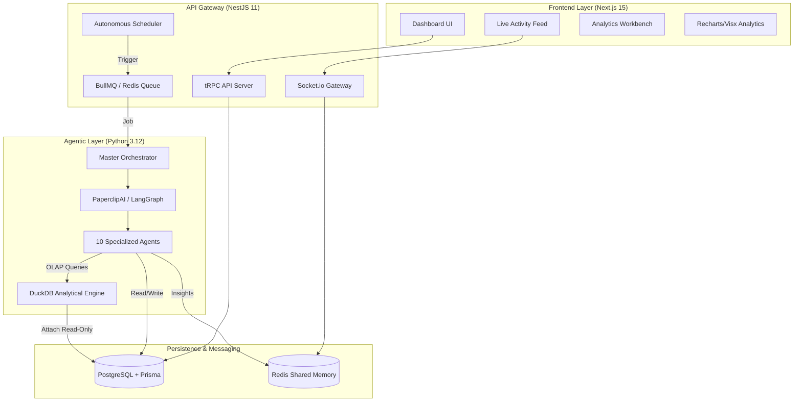
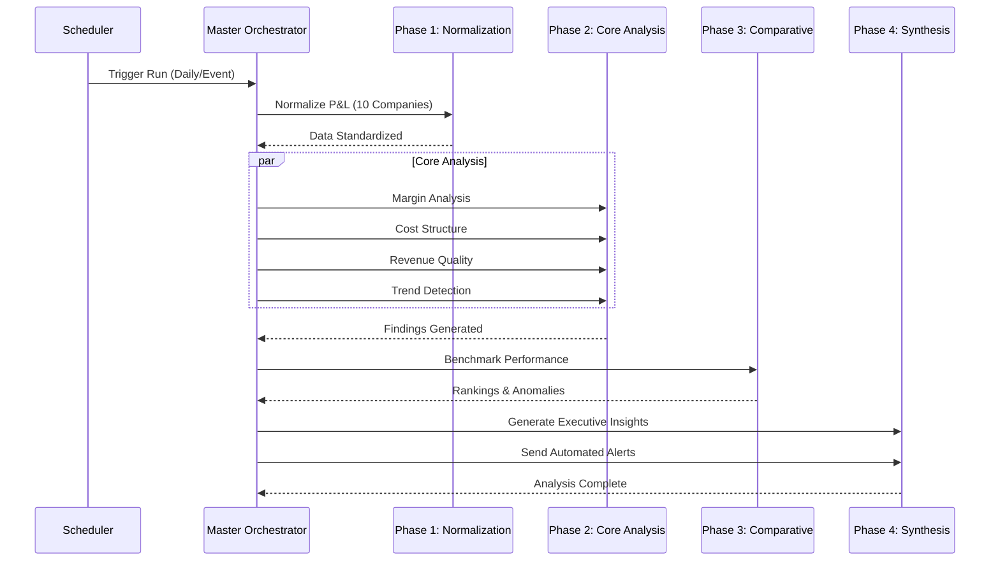
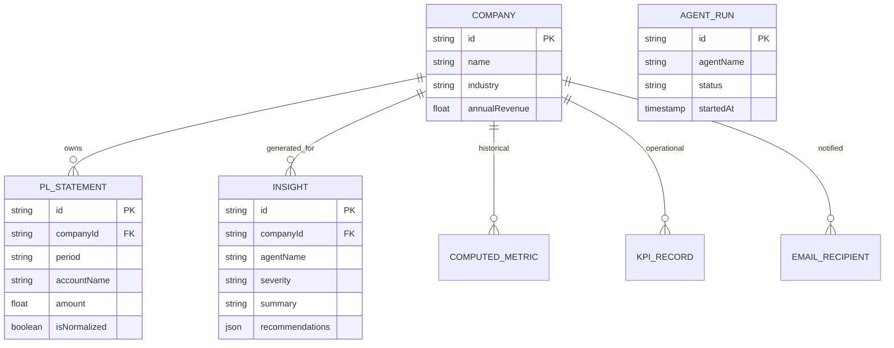

# Pinnacle AI — Portfolio Intelligence Platform
Pinnacle AI is a production-grade, autonomous multi-agent platform designed for Private Equity firms to monitor, analyze, and benchmark P&L performance across a diverse portfolio. The system automates the transition from raw, fragmented financial data to executive-level insights and board-ready reporting.

---
## 🖼 Screenshots


### 🚀 Tech Stack Highlights

| Layer | Technologies |
| :--- | :--- |
| **Frontend** |       |
| **Backend** |       |
| **AI Agents** |       |
| **Infra/Dev** |     |

---


## 🏛️ System Architecture

Pinnacle AI is built as a high-performance monorepo, leveraging a hybrid TypeScript/Python stack with **LangGraph** orchestration via the **PaperclipAI** engine to balance UI responsiveness with deep analytical intelligence.

### High-Level Design


---

## 🤖 Agentic Intelligence (4-Phase Pipeline)

The system utilizes 10 specialized agents coordinated by a **Master Orchestrator**. The pipeline follows a structured reasoning path to ensure data integrity before synthesis.

### Agent Workflow Diagram


### The 10 Specialized Agents
| Agent | Role | Key Analytical Strategy |
| :--- | :--- | :--- |
| **1. Master Orchestrator** | Coordination | LangGraph state management & task routing. |
| **2. P&L Normalization** | Preparation | LLM category mapping of disparate COAs. |
| **3. Margin Analysis** | Core Analysis | Gross/EBITDA decomposition via Pandas. |
| **4. Cost Structure** | Core Analysis | Fixed vs. Variable operating leverage analysis. |
| **5. Revenue Quality** | Core Analysis | Customer concentration & recurring revenue health. |
| **6. Trend Detection** | Core Analysis | Linear regression for growth trajectory signaling. |
| **7. Benchmark & Peer** | Comparative | Cross-portfolio & industry percentile ranking (DuckDB). |
| **8. Anomaly Detection** | Comparative | Statistical variance & outlier detection (Z-Score). |
| **9. Best Practice ID** | Comparative | Tactic transference from top to low performers. |
| **10. Insight Synthesis** | Synthesis | Board-ready natural language (Llama 3.3-70b). |

---

## 📊 Database Schema

The system uses **PostgreSQL** with **Prisma ORM** for high-integrity financial records.



---

## 🚀 Exact Local Setup Guide

Follow these steps precisely to get the full Pinnacle AI platform running on your local machine.

### 📋 Prerequisites

| Tool | Version | Purpose |
| :--- | :--- | :--- |
| **Node.js** | `v22+` | Core platform runtime |
| **pnpm** | `v9+` | Fast package management |
| **Python** | `v3.12+` | Multi-agent logic (ML/Analytical layer) |
| **Docker Desktop** | Latest | Infrastructure (Postgres, Redis) |

### 1. Repository & Environment
```bash
# Clone the repository
git clone https://github.com/ankurraj2003/PinnacleAI.git
cd PinnacleAI

# Copy the example environment file
cp .env.example .env
```

> [!IMPORTANT]
> Update the `.env` file with your **GROQ_API_KEY** and **RESEND_API_KEY**. The default `DATABASE_URL` and `REDIS_URL` are pre-configured for the Docker local setup.

### 2. Node.js & Workspace Installation
```bash
# Install root and workspace dependencies (Web & API)
npm install -g pnpm
pnpm install
```

### 3. Python Multi-Agent Setup
We use a dedicated virtual environment for the AI agentic layer.
```bash
# 1. Create a virtual environment
python -m venv .venv

# 2. Activate the environment
# Windows:
.venv\Scripts\activate
# Mac / Linux:
source .venv/bin/activate

# 3. Install agent-specific dependencies
pip install -r packages/agents/requirements.txt
```

### 4. Infrastructure & Database Initialization
```bash
# Start Docker services (PostgreSQL & Redis)
docker compose up -d

# Initialize the Database Schema (Prisma)
pnpm db:push

# Seed the portfolio (14,000+ data points for 10 companies)
pnpm db:seed
```

### 5. Running the Application
To verify the full "Human-Agent" interaction, you must run all three services concurrently.

| Service | Command | Endpoints |
| :--- | :--- | :--- |
| **NestJS API** | `pnpm dev:api` | `http://localhost:3001` (tRPC/WS) |
| **Next.js Web** | `pnpm dev:web` | `http://localhost:3000` (Dashboard) |
| **Python Agents** | `pnpm dev:agents`| `http://localhost:8001` (Agent Server) |

---

## 🛠️ API & Tooling Documentation

### tRPC Procedures (Main)
- `portfolio.getSummary`: Aggregate PE metrics (Total Revenue, EBITDA, Trends).
- `portfolio.getHeatmapData`: Grid matrix of KPIs across all portfolio companies.
- `insights.list`: Searchable and filterable feed of agent-generated observations.
- `agents.runFullAnalysis`: Triggers the 4-phase LangGraph pipeline asynchronously.
- `agents.getStatus`: Real-time status polling for active orchestration tasks.
- `reports.generatePDF`: On-demand Puppeteer-driven PDF generation for board-ready reports.
- `workbench.nlQuery`: Real-time LLM-driven query (Groq Llama-3.3-70b) against the portfolio.
- `email.sendTest`: Triggers the Resend production email flow with React templates.

### Monitoring & Observability
- **Socket.io**: Live events streamed on `agent:started`, `agent:progress`, and `agent:terminated` channels.
- **Prisma Studio**: View and edit the 11 tables with zero-config (`pnpm prisma studio`).

---

## 📝 Written Summary: Approach & Decisions

### 1. The Multi-Model Strategy
We utilize **Groq**'s ultra-fast Llama-3 inference. Specialized agents use `llama-3.1-8b-instant` for rapid data parsing/math, while the **Insight Synthesis Agent** uses `llama-3.3-70b-versatile` for high-reasoning board-ready commentary. This balances cost, speed, and analytical depth.

### 2. Redis-Backed Shared Memory
Agents communicate through a shared finding store in Redis. This allows Phase 3 agents (Benchmarking) to consume computed metrics generated by Phase 2 agents (Margin/Cost) without re-calculating or additional DB overhead.

### 3. DuckDB for Real-Time OLAP
For complex portfolio-wide benchmarking, the Python agents use **DuckDB** to query the PostgreSQL tables. This allows for columnar performance on a row-oriented database, enabling instant percentile calculations across 14,000+ financial records.

### 4. Autonomous First Architecture
The system is built on a "Pull" rather than "Push" model. The **Scheduler Service** in NestJS acts as the heartbeat, ensuring that even if the UI is closed, the Analytical Pipeline runs every minute (dev mode) or on its daily/weekly triggers.

---

## 🔮 Future Improvements & Limitations
- **Predictive Forecaster**: Moving from linear statistical trends to ML-based forecasting (Prophet).
- **RAG for Financial Docs**: Adding a vector store (Pinecone) to allow agents to read MD&A PDF documents alongside raw P&L numbers.
- **Langflow Execution**: The platform includes a visual `pipeline.json`, but currently uses code-based orchestration for reliability. Full runtime integration with the Langflow server is the next step.

---
