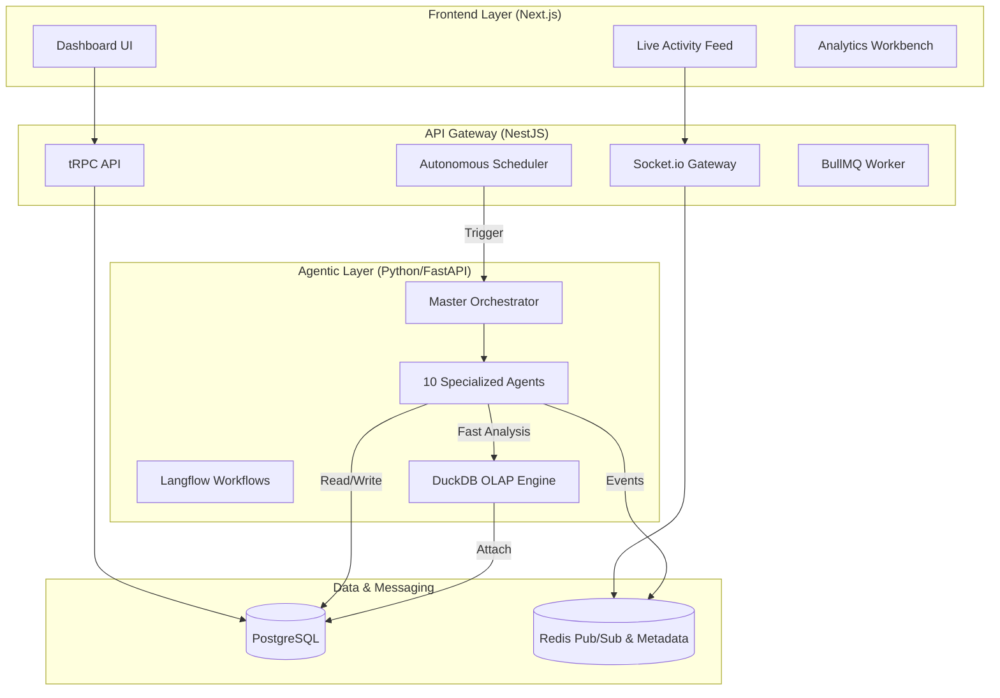
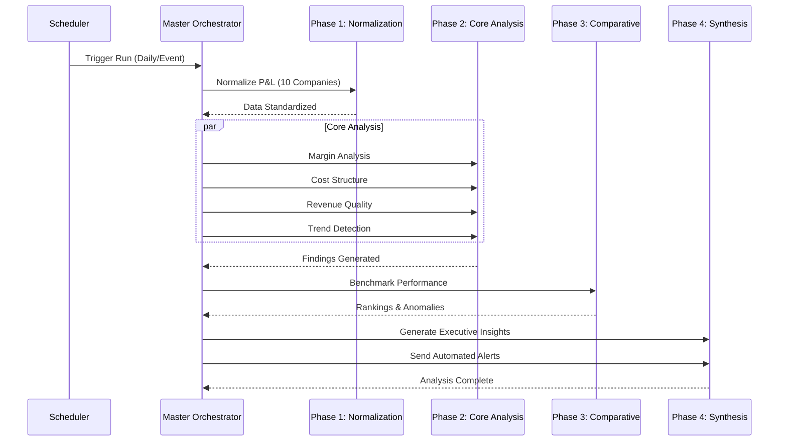
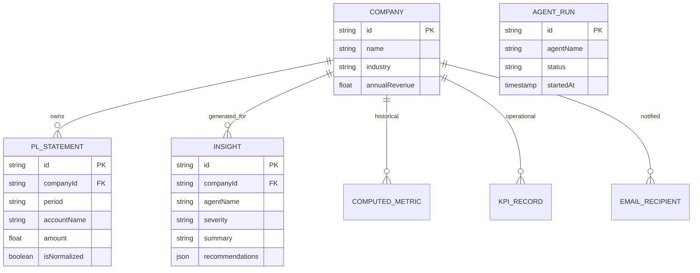

# Pinnacle AI — Portfolio Intelligence Platform


> **Assessment Submission**: TalentDeel Developer Assessment — Assignment 3: Portfolio-Wide P&L Analysis & Benchmarking.

Pinnacle AI is a production-grade, autonomous multi-agent platform designed for Private Equity firms to monitor, analyze, and benchmark P&L performance across a diverse portfolio. The system automates the transition from raw, fragmented financial data to executive-level insights and board-ready reporting.

---

## 🏛️ System Architecture

Pinnacle AI is built as a high-performance monorepo, leveraging a hybrid TypeScript/Python stack to balance UI responsiveness with deep analytical intelligence.

### High-Level Design


---

## 🤖 Agentic Intelligence (4-Phase Pipeline)

The system utilizes 10 specialized agents coordinated by a **Master Orchestrator**. The pipeline follows a structured reasoning path to ensure data integrity before synthesis.

### Agent Workflow Diagram


### The 10 Agents
1.  **Master Orchestrator**: Manages state, error recovery, and cross-phase handoffs.
2.  **P&L Normalization Agent**: Uses LLM reasoning to map disparate Chart of Accounts (CoA) to a standard PE hierarchy.
3.  **Margin Analysis Agent**: Decomposes Gross and EBITDA margins across time and segments.
4.  **Cost Structure Agent**: Identifies fixed vs. variable cost inefficiencies.
5.  **Revenue Quality Agent**: Analyzes customer concentration and recurring revenue health.
6.  **Benchmark & Peer Agent**: Ranks performance against internal portfolio and external industry percentiles.
7.  **Trend Detection Agent**: Signals early warnings on margin contraction or expense spikes.
8.  **Anomaly Detection Agent**: Flags statistical outliers in line-item spending.
9.  **Best Practice Identifier**: Connects "Top Performers" to "Low Performers" via actionable recommendations.
10. **Insight & Communication Agent**: Synthesizes all findings into board-ready natural language and sends Resend emails.

---

## 📊 Database Schema

The system uses **PostgreSQL** with **Prisma ORM** for high-integrity financial records.



---

## 🚀 Setup Instructions

### Prerequisites
- **Node.js 22+** & **pnpm 9+**
- **Python 3.12+**
- **Docker Desktop** (for PostgreSQL & Redis)

### 1. Environment Setup
```bash
git clone <repo-url>
cd PinnacleAI
cp .env.example .env
# Required keys: GROQ_API_KEY, RESEND_API_KEY (optional for test mode)
```

### 2. Dependency Installation
```bash
# Monorepo and Frontend/API
pnpm install

# Python Agent Virtual Env
python -m venv .venv
source .venv/bin/activate  # macOS/Linux
.venv\Scripts\activate     # Windows
pip install -r packages/agents/requirements.txt
```

### 3. Database & Infrastructure
```bash
# Start Postgres & Redis
docker compose up -d

# Push Schema & Seed 14K+ rows of financial data
pnpm db:push
pnpm db:seed
```

### 4. Running the Platform
Open three terminals or use the VS Code Task "Run All":
```bash
# Terminal 1: NestJS API
pnpm dev:api

# Terminal 2: Next.js Web
pnpm dev:web

# Terminal 3: Agent Server
pnpm dev:agents
```
Visit **http://localhost:3000**.

---

## 🛠️ API & Tooling Documentation

### tRPC Procedures (Main)
- `agents.getPipelineStatus`: Returns real-time health of the 10-agent pipeline.
- `agents.getRecentRuns`: History of autonomous execution.
- `agents.triggerFullPipeline`: Manual trigger (for demo/testing).
- `workbench.nlQuery`: Real-time LLM-driven query against the entire portfolio.
- `email.sendTest`: Triggers the Resend production email flow.

### Monitoring & Observability
- **Socket.io**: Live events streamed on `agent:status` and `activity:new` channels.
- **Prisma Studio**: View and edit the 11 tables (`pnpm prisma studio`).

---

## 📝 Written Summary: Approach & Decisions

### 1. The Multi-Model Strategy
We utilize **Groq**'s ultra-fast Llama-3 inference. Specialized agents use `llama-3.1-8b-instant` for rapid data parsing/math, while the **Insight Synthesis Agent** uses `llama-3.3-70b-versatile` for high-reasoning board-ready commentary. This balances cost, speed, and analytical depth.

### 2. Redis-Backed Shared Memory
Agents communicate through a shared finding store in Redis. This allows Phase 3 agents (Benchmarking) to consume computed metrics generated by Phase 2 agents (Margin/Cost) without re-calculating or additional DB overhead.

### 3. DuckDB for Real-Time OLAP
For complex portfolio-wide benchmarking, the Python agents use **DuckDB** to query the PostgreSQL tables. This allows for columnar performance on a row-oriented database, enabling instant percentile calculations across 14,000+ financial records.

### 4. Autonomous First Architecture
The system is built on a "Pull" rather than "Push" model. The **Scheduler Service** in NestJS acts as the heartbeat, ensuring that even if the UI is closed, the Analytical Pipeline runs every minute (dev mode) or on its daily/weekly triggers.

---

## 🔮 Future Improvements & Limitations
- **PDF Export**: Currently, reports are generated as structured JSON/HTML; full PDF generation using Puppeteer is slated for V2.
- **Predictive Forecaster**: Moving from linear statistical trends to ML-based forecasting (Prophet).
- **RAG for Financial Docs**: Adding a vector store (Pinecone) to allow agents to read MD&A PDF documents alongside raw P&L numbers.
- **Langflow Execution**: The platform includes a visual `pipeline.json`, but currently uses code-based orchestration for reliability. Full runtime integration with the Langflow server is the next step.

---

**Contact**: Built for TalentDeel Developer Assessment — Assignment 3.
